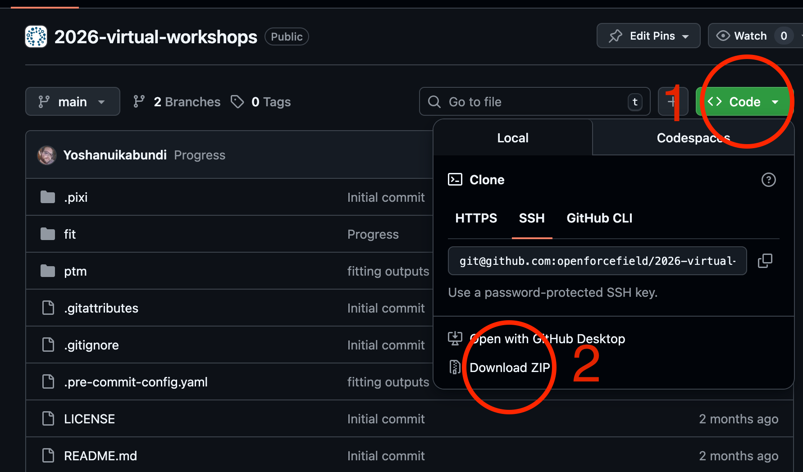

# 2026 OpenFF Workshops

This year we have both conda/mamba and pixi environments available. Downloading the workshop materials and installing dependencies can take a while, so please run these ahead of time.

## 1. Get the workshop files

### Option A: Git clone

`git clone https://github.com/openforcefield/2026-virtual-workshops.git`

### Option B: Download zipped repo manually

Click the following on the top of this page:



## 2. Install workshop dependencies and run notebook

**Note**: OpenFF software is built for Linux/Mac only. Some users have reported success running OpenFF on the Windows Subsystem for Linux (WSL), but it will not work in native Windows. 

### Option A: Using conda/(micro)mamba

If you don't already have conda/mamba/micromamba installed, you can quickly install micromamba in your local directory. The fastest way is using the instructions [here](https://mamba.readthedocs.io/en/latest/installation/micromamba-installation.html).

Then for the fitting workshop run:

```
micromamba env create -y -f fit_env.yaml
micromamba activate fitting-workshop
cd fit
jupyter-lab fitting-workshop.ipynb
``` 

or for the PTM workshop run:

```
micromamba env create -y -f ptm_env.yaml
micromamba activate ptm-workshop
cd ptm
jupyter-lab ptm-workshop.ipynb
``` 


(replace `micromamba` with `mamba` or `conda` depending on which one you have available)


### Option B: Using pixi

See instructions for getting pixi [here](https://pixi.prefix.dev/latest/installation/).

Run the PTM workshop:

```shell
pixi r ptm-workshop
```

Run the fitting workshop:

```shell
pixi r fitting-workshop
```
